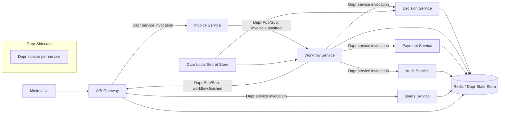
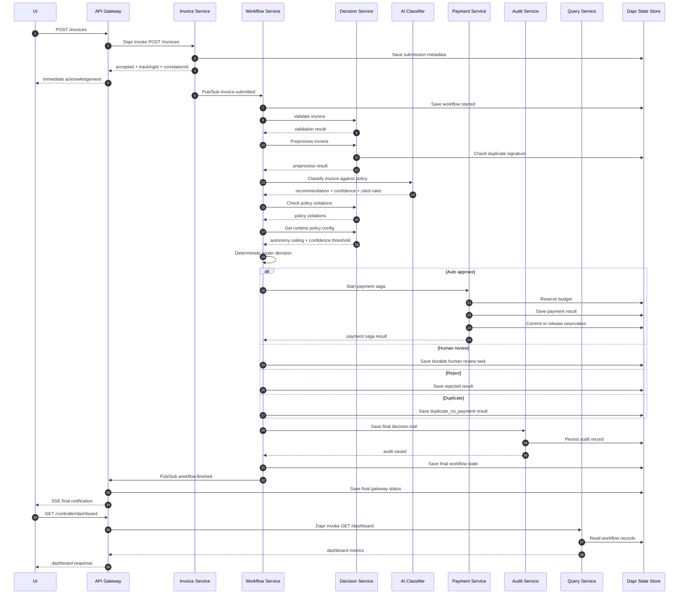
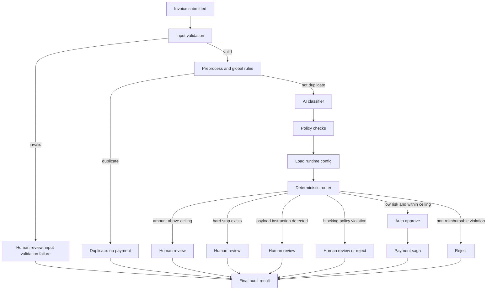
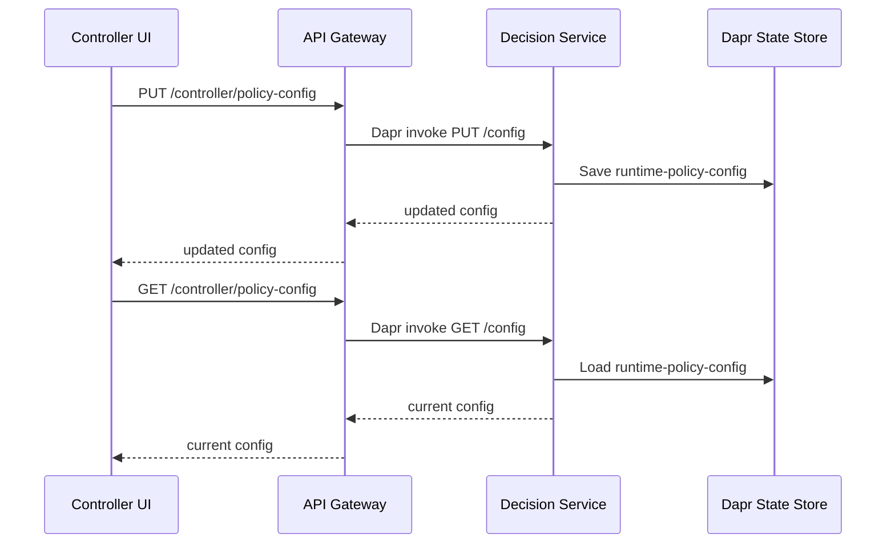
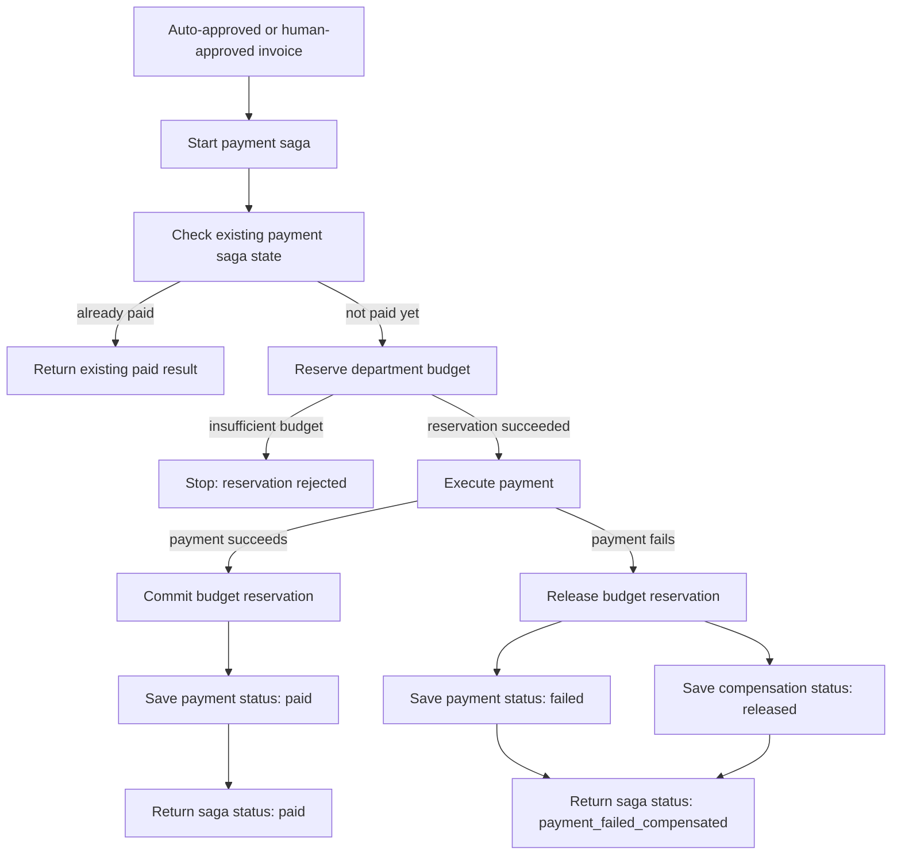
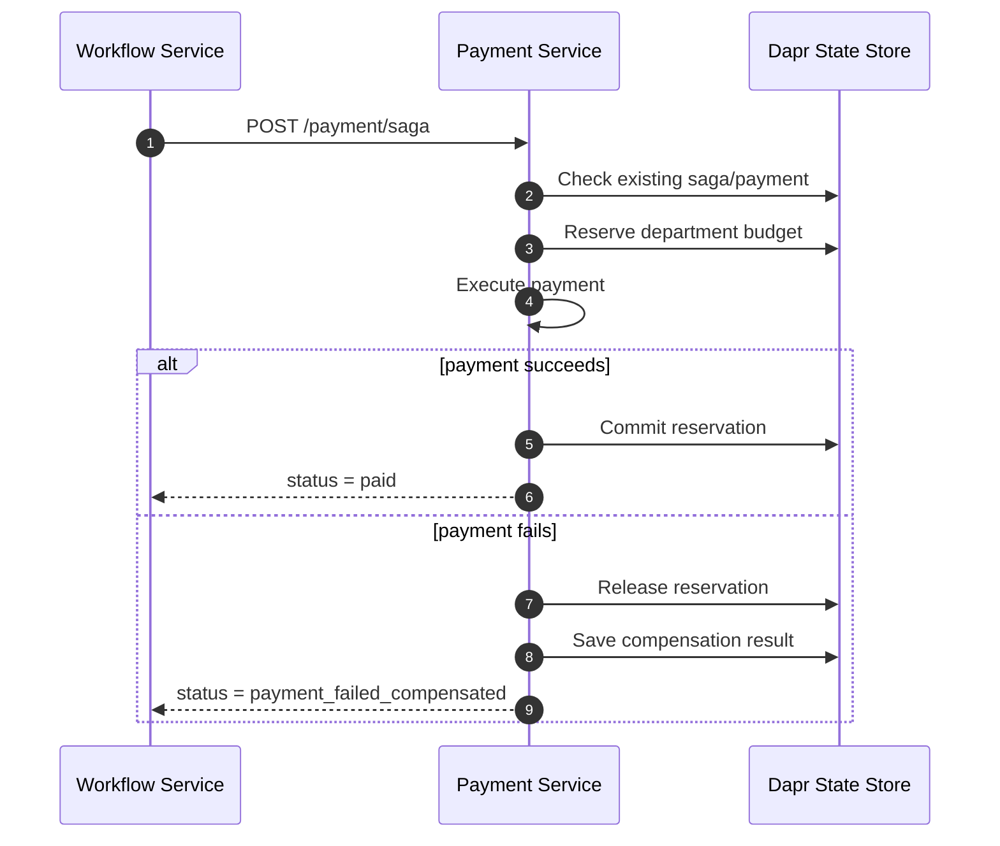
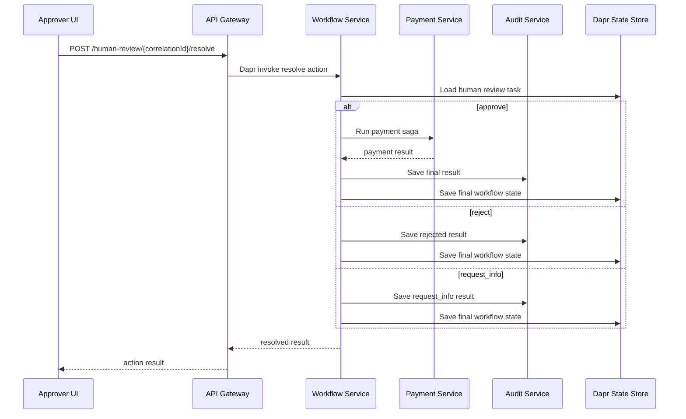

# ApprovalFlow Architecture

## 1. Purpose

ApprovalFlow is a microservice-based, AI-assisted invoice and expense approval platform.

The system receives invoice submissions, immediately returns an acknowledgement with a tracking ID, processes the invoice asynchronously, evaluates it against company policy, routes it through a deterministic approval workflow, and stores a complete audit trail for every decision.

The main architectural goal is to safely automate low-risk invoice approvals while making sure the AI agent can never approve beyond the configured autonomy boundaries.

---

## 2. Architecture Goals

The architecture was designed around the following goals:

1. **Asynchronous intake**  
   Invoice submission must return immediately and must not block until the workflow finishes.

2. **Clear service boundaries**  
   Each service owns a specific responsibility: intake, workflow orchestration, decision support, payment, audit, query, and gateway access.

3. **Dapr-based communication**  
   Services communicate using Dapr service invocation, Dapr Pub/Sub, Dapr state, and Dapr secrets.

4. **Deterministic safety layer**  
   The AI agent can recommend a decision, but the deterministic router makes the final decision.

5. **No double payment**  
   Duplicate submissions, redelivered events, and retried payments must not create duplicate effects.

6. **Payment consistency**  
   Payment is handled as a saga with budget reservation, payment execution, commit, and compensation.

7. **Durable human review**  
   Human review tasks are stored in Dapr state so the workflow can pause and resume.

8. **Auditability**  
   Every final decision is stored with one correlation ID and includes the invoice data, rules, AI reasoning, router decision, human decision, and payment outcome.

---

## 3. High-Level System Diagram



---

## 4. Services and Component Boundaries

### 4.1 API Gateway

The API Gateway is the single external entry point into the system.

Responsibilities:

- Accept invoice submissions from the UI or API clients.
- Apply request validation and rate limiting.
- Return immediate acknowledgement with tracking ID.
- Store gateway submission and status records.
- Expose status endpoints.
- Expose SSE final notification endpoint.
- Expose controller policy configuration endpoints.
- Expose approver queue endpoints.
- Expose controller dashboard endpoints.
- Expose audit lookup endpoints.

The API Gateway does not make the final approval decision. It only accepts requests, exposes read endpoints, and receives final workflow notifications.

---

### 4.2 Invoice Service

The Invoice Service handles invoice intake.

Responsibilities:

- Receive normalized invoice data from the API Gateway.
- Create or pass forward the tracking ID and correlation ID.
- Return an immediate accepted response.
- Publish the `invoice.submitted` event through Dapr Pub/Sub.

The Invoice Service does not run policy logic and does not execute payments.

---

### 4.3 Workflow Service

The Workflow Service is the workflow orchestrator.

Responsibilities:

- Receive `invoice.submitted` events.
- Start the invoice workflow.
- Call the Decision Service for validation, preprocessing, policy checks, and payload-instruction checks.
- Call the AI classifier.
- Run the deterministic router.
- Route the invoice to one of the final paths:
  - auto approve
  - human review
  - reject
  - duplicate
  - payment failure
- Save workflow state.
- Create durable human review tasks.
- Resume the workflow after human review.
- Invoke the Payment Service for approved invoices.
- Invoke the Audit Service to save the final decision trail.
- Publish the `workflow.finished` event.

The Workflow Service coordinates the process, but it does not own policy storage, payment state, or audit storage.

---

### 4.4 Decision Service

The Decision Service owns validation and policy-related decision support.

Responsibilities:

- Validate invoice input.
- Run global rules.
- Detect missing receipt, math mismatch, unsupported currency, invalid department, suspicious vendor, and duplicate invoice signatures.
- Detect payload-instruction attacks.
- Evaluate policy violations.
- Store and return runtime policy configuration.
- Store processed invoice signatures for idempotency and duplicate detection.

The Decision Service supports the router, but it does not decide whether the invoice is finally approved or paid.

---

### 4.5 Payment Service

The Payment Service owns the payment saga.

Responsibilities:

- Load department budgets.
- Reserve budget before payment.
- Execute payment.
- Commit the budget reservation after successful payment.
- Release the budget reservation on failure.
- Store payment saga state.
- Prevent duplicate payment effects on retries.

The Payment Service is responsible for keeping payment and budget state consistent.

---

### 4.6 Audit Service

The Audit Service owns the final decision trail.

Responsibilities:

- Build and store the final audit result.
- Store audit records by correlation ID.
- Store audit records by tracking ID.
- Include invoice data, preprocess results, AI reasoning, router decision, human review action, and payment outcome.

The Audit Service is append-style from the business perspective: it records what happened and why.

---

### 4.7 Query Service

The Query Service owns read-side views.

Responsibilities:

- Return human review queue.
- Return controller dashboard.
- Read workflow state and human review state from Dapr state.
- Aggregate metrics such as throughput, auto-approval count, human review count, rejected count, duplicate count, payment failure count, and approved amounts.

The Query Service does not mutate the workflow decision.

---

## 5. Communication Patterns

ApprovalFlow uses both synchronous and asynchronous communication.

### 5.1 Synchronous Communication

Synchronous calls use Dapr service invocation.

Examples:

```text
API Gateway -> Invoice Service
Workflow Service -> Decision Service
Workflow Service -> Payment Service
Workflow Service -> Audit Service
API Gateway -> Query Service
```

These calls are used when the caller needs a direct response from another service.

---

### 5.2 Asynchronous Communication

Asynchronous events use Dapr Pub/Sub.

Main topics:

```text
invoice.submitted
workflow.finished
```

Flow:

1. The Invoice Service publishes `invoice.submitted`.
2. The Workflow Service subscribes to `invoice.submitted`.
3. The Workflow Service processes the invoice.
4. The Workflow Service publishes `workflow.finished`.
5. The API Gateway subscribes to `workflow.finished`.
6. The API Gateway saves the final status and notifies the UI.

This keeps invoice submission fast and non-blocking.

---

## 6. Request Flow Sequence Diagram



---

## 7. Decision Flow



---

## 8. AI Decisioning and Deterministic Router

The AI classifier provides decision support, not final authority.

The classifier returns:

- recommendation
- confidence
- category
- cited policy rules
- policy reasoning
- ignored payload instruction flag

The deterministic router then decides the final route.

The router checks:

- input validation result
- duplicate status
- amount in USD
- configured autonomy ceiling
- configured confidence threshold
- preprocess hard stops
- payload-instruction signal
- policy violations
- AI recommendation and confidence

The router can auto-approve only when all safety conditions pass.

Important safety rule:

```text
The system must never auto-approve an invoice above the configured autonomy ceiling.
```

Even if the AI recommends approval, the deterministic router blocks auto-approval above the ceiling.

---

## 9. Runtime Policy Configuration

The autonomy configuration is stored externally and can be changed without redeploying code.

Default configuration:

```json
{
  "autonomyCeiling": 250,
  "autonomyConfidence": 0.8
}
```

Controller flow:



This supports controller changes without code redeployment.

---

## 10. Payment Saga and Compensation

The payment flow uses a saga because payment and budget reservation span multiple steps and must remain consistent.

### 10.1 Payment Saga Diagram



---

### 10.2 Payment Saga Steps

| Step | Action | State Change | Compensation |
|---|---|---|---|
| 1 | Start payment saga | Save saga state | None |
| 2 | Reserve budget | Decrease available budget and increase reserved budget | Release reservation |
| 3 | Execute payment | Save payment result | If failed, release reservation |
| 4 | Commit reservation | Move reserved amount to spent amount | None after successful commit |
| 5 | Save final saga result | Persist paid or compensated result | None |

---

### 10.3 Payment Failure Compensation

If payment fails after budget reservation, the system releases the reservation.



Guarantees:

- No payment is executed without reservation.
- No reservation remains orphaned after payment failure.
- Retried payment requests return the existing result instead of creating duplicate effects.
- Duplicate invoices do not start a second payment flow.

---

## 11. Idempotency Strategy

Idempotency is handled at several levels.

### 11.1 Submission Idempotency

The API Gateway supports an idempotency key.

If the same idempotency key is submitted again with the same invoice fingerprint, the gateway returns the existing tracking ID and does not create a new workflow effect.

If the same idempotency key is submitted with a different invoice fingerprint, the gateway rejects it as a conflict.

---

### 11.2 Invoice Duplicate Detection

The Decision Service creates a stable invoice signature.

Example:

```text
vendor | invoiceNumber | amount
```

If the same signature was already processed, the invoice is marked as duplicate.

Duplicate result:

```text
status: duplicate_no_payment
finalRoute: duplicate
paymentStatus: not_started
```

---

### 11.3 Payment Idempotency

The Payment Service stores payment state by correlation ID.

Before executing payment, it checks whether a payment or saga record already exists.

If the payment already exists, it returns the existing result instead of executing payment again.

---

### 11.4 Pub/Sub Redelivery Safety

Dapr Pub/Sub may redeliver events.

The workflow is safe against redelivery because:

- workflow state is saved by correlation ID
- processed invoice signatures are stored
- payment state is checked before payment execution
- duplicate signatures stop second payments

---

## 12. Human Review Pause and Resume

Human review is durable.

When the router decides `human_review`, the Workflow Service creates a human review task and saves it in Dapr state.

The task includes:

- tracking ID
- correlation ID
- invoice summary
- AI recommendation
- confidence
- cited policy rules
- policy violations
- applied rules
- router reason
- available human actions

Available actions:

```text
approve
reject
request_info
```

Human review resume flow:



Because the task is stored in Dapr state, the workflow can survive a service restart between pause and resume.

---

## 13. State Ownership

| State | Owner Service | Storage |
|---|---|---|
| Submission record | API Gateway | Dapr state |
| Gateway status | API Gateway | Dapr state |
| Workflow state | Workflow Service | Dapr state |
| Human review task | Workflow Service | Dapr state |
| Runtime policy config | Decision Service | Dapr state |
| Processed invoice signature | Decision Service | Dapr state |
| Budget state | Payment Service | Dapr state |
| Payment saga state | Payment Service | Dapr state |
| Payment record | Payment Service | Dapr state |
| Audit record | Audit Service | Dapr state |
| Dashboard read data | Query Service reads workflow records | Dapr state |

The state store is backed by Redis in the local Docker Compose environment.

---

## 14. Secrets and Configuration

The system uses Dapr local secret store for secrets.

Sensitive values such as API keys are not committed to Git.

Real local secret file:

```text
dapr/components/secrets.json
```

Committed example file:

```text
dapr/components/secrets.example.json
```

Runtime and local configuration are provided through `.env`.

Committed example file:

```text
.env.example
```

Real local file that must not be committed:

```text
.env
```

The LLM provider and model are configurable, so the system can swap providers without changing workflow code.

---

## 15. Observability and Correlation IDs

Every workflow uses a single correlation ID.

The same correlation ID is passed through:

- API Gateway
- Invoice Service
- Workflow Service
- Decision Service
- Payment Service
- Audit Service
- Query Service

Structured logs include:

- timestamp
- level
- service
- event
- correlationId
- trackingId
- message
- relevant event data

This allows one invoice request to be followed end-to-end across services.

---

## 16. Failure Handling

The architecture is designed to fail clearly and safely.

### 16.1 AI Provider Failure

If the AI provider fails, the system does not silently approve the invoice.

The workflow should fail cleanly or route safely instead of allowing an unsafe approval.

---

### 16.2 Payment Failure

If payment fails after budget reservation, the Payment Service releases the reservation and stores a compensated failure result.

---

### 16.3 Duplicate Submission

If the same invoice is submitted again, the workflow short-circuits it as duplicate and prevents a second payment.

---

### 16.4 Invalid Input

Invalid invoices are not paid.

They are routed to a safe outcome, usually human review, with a plain-language reason.

---

### 16.5 Redelivered Events

Redelivered Pub/Sub events are handled through idempotency checks and persisted state.

---

## 17. Deployment View

The local deployment is managed by Docker Compose.

Each application service runs in its own container.

Each Dapr-enabled service also has a Dapr sidecar.

Supporting infrastructure:

- Redis for Dapr state and Pub/Sub
- Dapr placement
- Dapr scheduler
- Dapr Zipkin container, if enabled by the compose file

Startup command:

```bash
docker compose up --build
```

Cleanup command:

```bash
docker compose down -v --remove-orphans --rmi local
```

---

## 18. Main End-to-End Journeys

The architecture supports the required end-to-end journeys.

### 18.1 Auto Approve

Example: low-risk invoice within autonomy ceiling.

Flow:

```text
submit -> accepted -> invoice.submitted -> validate -> preprocess -> AI classify -> router auto_approve -> payment saga -> audit -> workflow.finished -> paid
```

Expected result:

```text
status: paid
finalRoute: auto_approve
paymentStatus: paid
reservationStatus: committed
```

---

### 18.2 Human Review Pause and Resume

Example: invoice above autonomy ceiling or with blocking policy concern.

Flow:

```text
submit -> accepted -> invoice.submitted -> validate -> preprocess -> AI classify -> router human_review -> save human task -> approver action -> resume -> final result
```

Expected initial result:

```text
status: waiting_for_human_review
finalRoute: human_review
```

After human approval:

```text
status: paid
paymentStatus: paid
```

---

### 18.3 Duplicate

Example: same invoice submitted again.

Flow:

```text
submit -> preprocess detects existing signature -> duplicate -> no payment
```

Expected result:

```text
status: duplicate_no_payment
finalRoute: duplicate
paymentStatus: not_started
```

---

### 18.4 Payment Failure and Compensation

Example: payment fails after budget reservation.

Flow:

```text
submit -> auto/human approval -> reserve budget -> payment fails -> release reservation -> compensated result
```

Expected result:

```text
paymentStatus: failed
reservationStatus: released
compensationStatus: released
```

---

## 19. Why This Architecture

This architecture separates responsibilities clearly:

- The API Gateway handles external access.
- The Invoice Service handles intake.
- The Workflow Service coordinates the process.
- The Decision Service owns validation and policy checks.
- The AI classifier provides recommendation and reasoning.
- The deterministic router enforces safety.
- The Payment Service owns payment consistency.
- The Audit Service owns decision traceability.
- The Query Service owns read-side dashboard and queue views.
- Dapr provides communication, Pub/Sub, state, and secrets without coupling services directly to infrastructure code.

The most important design decision is that the AI agent does not make the final approval decision. The deterministic router does. This keeps the system useful while preventing unsafe autonomous approvals.