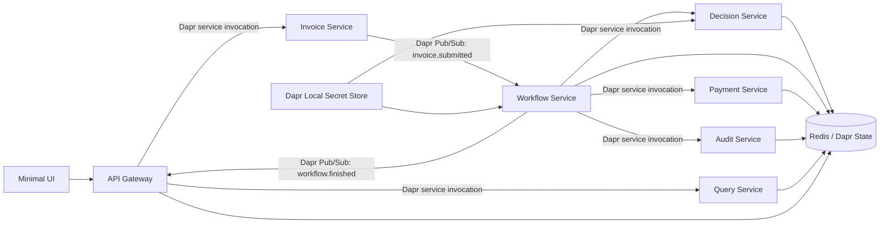
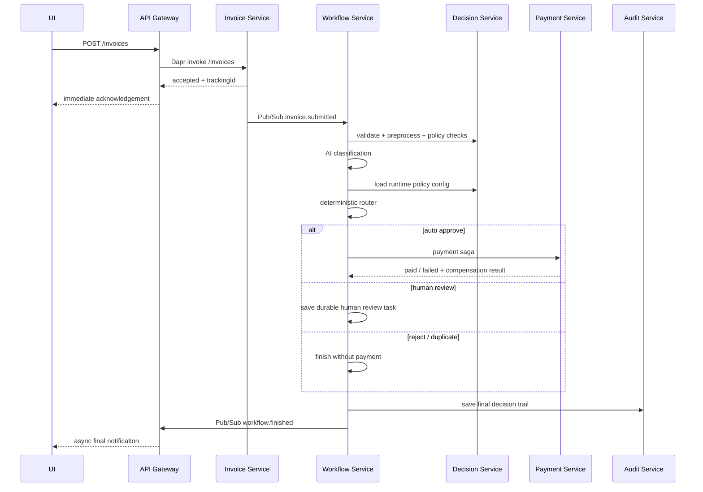
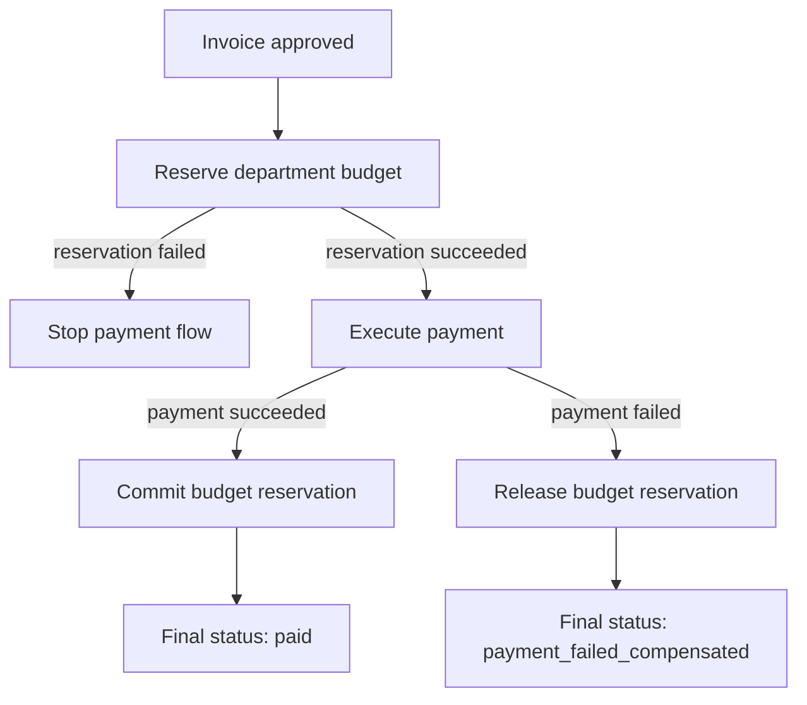

# ApprovalFlow — Invoice & Expense Approval Platform

ApprovalFlow is a microservice-based, AI-assisted invoice and expense approval platform.

The system accepts invoice submissions asynchronously, evaluates them against an expense policy, automatically approves low-risk invoices, escalates unclear, risky, invalid, or high-value invoices to a human approver, and stores a complete audit trail for every decision.

The project demonstrates microservice architecture, Dapr service invocation, Dapr Pub/Sub, Dapr state management, Dapr secrets, idempotency, human-in-the-loop workflow, payment saga compensation, structured logging, runtime configuration, and AI-assisted decisioning.

---

## Main Goal

The main business dilemma is deciding how much autonomy the AI-assisted approval system should have.

This implementation uses a conservative but useful autonomy posture:

- Low-risk invoices can be auto-approved.
- Invoices above the configured autonomy ceiling must not be auto-approved.
- Risky, unclear, invalid, duplicate, or policy-sensitive invoices are escalated or rejected deterministically.
- The deterministic router makes the final decision, not the AI agent alone.
- The AI agent provides a recommendation, confidence, reasoning, and cited policy rules.
- The system can prove that it never auto-approves above the configured ceiling.

Default autonomy configuration:

```text
AUTONOMY_CEILING=250.0
AUTONOMY_CONFIDENCE=0.80
```

The AI agent is used as a decision-support component. The final approval route is enforced by deterministic code.

---

## Technologies Used

- Python
- FastAPI
- Uvicorn
- Docker
- Docker Compose
- Dapr
- Redis
- Dapr Service Invocation
- Dapr Pub/Sub
- Dapr State Store
- Dapr Local Secret Store
- OpenAI-compatible LLM provider
- HTML / JavaScript minimal UI
- GitHub Actions / CI quality checks

---

## Documentation

Additional project documentation:

```text
ARCHITECTURE.md
docs/adr/ADRS.md
docs/openapi.json
```

### Architecture Document

`ARCHITECTURE.md` explains the system architecture, service boundaries, request flow, payment saga, compensation flow, state ownership, Dapr usage, and decisioning model.

### Architecture Decision Records

`docs/adr/ADRS.md` documents the main architecture decisions using the ADR format:

```text
Context → Decision → Consequences
```

The ADRs explain why the project uses Dapr, a deterministic router, payment saga, Dapr state, runtime configuration, a separate audit service, and an API Gateway.

### API Documentation

The API is documented using FastAPI's auto-generated OpenAPI documentation.

After starting the system, the API documentation is available at:

```text
http://localhost:8000/docs
```

The raw OpenAPI specification is available at:

```text
http://localhost:8000/openapi.json
```

A saved copy of the OpenAPI specification can also be stored in the repository as:

```text
docs/openapi.json
```

To generate the saved OpenAPI file locally while the system is running:

```powershell
mkdir docs
Invoke-WebRequest -Uri "http://localhost:8000/openapi.json" -OutFile "docs\openapi.json"
```

The API Gateway is the single external entry point, so the documented external API is exposed through the gateway.

---

## Architecture Overview

The system is built as several containerized microservices. Each service communicates through its own Dapr sidecar.



---

## Services

### API Gateway

Single external entry point for the system.

Responsibilities:

- Accept invoice submissions.
- Return immediate acknowledgement with tracking ID.
- Expose status endpoints.
- Expose SSE notification endpoint.
- Expose approver queue actions.
- Expose controller dashboard.
- Expose runtime policy configuration.
- Expose audit lookup endpoints.
- Receive final `workflow.finished` events.

Main exposed port:

```text
http://localhost:8000
```

---

### Invoice Service

Responsible for accepting and normalizing invoice submissions.

Responsibilities:

- Receive invoice data from the API Gateway.
- Create tracking ID and correlation ID.
- Build submit response.
- Publish `invoice.submitted` event through Dapr Pub/Sub.

---

### Workflow Service

Responsible for orchestrating the invoice approval workflow.

Responsibilities:

- Receive `invoice.submitted` events.
- Run validation and preprocessing.
- Call the AI classifier.
- Call deterministic policy checks.
- Load runtime autonomy configuration.
- Route the invoice deterministically.
- Pause for human review when needed.
- Resume after human decision.
- Invoke payment saga for approved invoices.
- Invoke the Audit Service to save the final decision trail.
- Publish final `workflow.finished` event.

---

### Decision Service

Responsible for validation, policy checks, duplicate checks, and runtime policy configuration.

Responsibilities:

- Validate invoice input.
- Run global rules.
- Detect duplicate invoices.
- Detect payload-instruction attacks.
- Evaluate policy violations.
- Store and return runtime policy configuration.
- Store processed invoice signatures for idempotency and duplicate detection.

---

### Payment Service

Responsible for the payment saga.

Responsibilities:

- Reserve department budget.
- Execute payment.
- Commit budget reservation after successful payment.
- Release reservation on payment failure.
- Store payment saga state.
- Prevent duplicate payments.

---

### Audit Service

Responsible for storing the final decision trail.

Responsibilities:

- Store final result by correlation ID.
- Store final result by tracking ID.
- Include invoice data, rules, AI reasoning, router decision, human action, and payment outcome.

---

### Query Service

Responsible for read-side views.

Responsibilities:

- Human review queue.
- Controller dashboard.
- Aggregated status information.

---

## Request Flow



---

## Payment Saga

The payment flow is implemented as a saga to avoid partial or inconsistent outcomes.



Guarantees:

- No payment without budget reservation.
- No orphaned reservation after payment failure.
- No double payment for duplicate or retried submissions.
- Payment result is stored in Dapr state.
- Reservation state is committed or released according to the payment result.

---

## Configuration

Runtime and local configuration are stored in `.env`.

Example:

```env
SAMPLE_INVOICES_PATH=config/sample-invoices.json
POLICY_PATH=config/policy.md

AUTONOMY_CEILING=250.0
AUTONOMY_CONFIDENCE=0.80

DAPR_HTTP_PORT=3500
DAPR_BASE_URL=http://127.0.0.1:3500
DAPR_PUBSUB_NAME=pubsub
DAPR_STATE_STORE_NAME=statestore
DAPR_SECRET_STORE_NAME=local-secret-store

DECISION_SERVICE_APP_ID=decision-service
PAYMENT_SERVICE_APP_ID=payment-service
AUDIT_SERVICE_APP_ID=audit-service
```

The repository should include:

```text
.env.example
```

The repository should not include the real local `.env` file.

---

## Secrets

The real API key must not be committed.

The real local secrets file is:

```text
dapr/components/secrets.json
```

Example real local file:

```json
{
  "OPENAI_API_KEY": "your-real-api-key-here",
  "LLM_PROVIDER": "openai",
  "LLM_MODEL": "gpt-4o-mini"
}
```

This file must stay local only and must be ignored by Git.

The repository should include only the example file:

```text
dapr/components/secrets.example.json
```

Example:

```json
{
  "OPENAI_API_KEY": "your_api_key_here",
  "LLM_PROVIDER": "openai",
  "LLM_MODEL": "gpt-4o-mini"
}
```

---

## Repository Hygiene

The repository includes a `.gitignore` that excludes local secrets, local environment files, logs, Python cache files, and runtime artifacts.

Important files that should not be committed:

```text
.env
dapr/components/secrets.json
__pycache__/
*.pyc
*.log
```

Important example files that should be committed:

```text
.env.example
dapr/components/secrets.example.json
```

If `secrets.json` or `.env` were accidentally tracked by Git, remove them from Git tracking without deleting the local files:

```powershell
git rm --cached .env
git rm --cached dapr/components/secrets.json
```

---

## How to Run Locally

### 1. Clone the repository

```bash
git clone <repo-url>
cd "Final Assignment"
```

### 2. Create local configuration files

Create `.env` from `.env.example`:

```bash
cp .env.example .env
```

On Windows PowerShell:

```powershell
Copy-Item .env.example .env
```

Create the real local secrets file from the example:

```bash
cp dapr/components/secrets.example.json dapr/components/secrets.json
```

On Windows PowerShell:

```powershell
Copy-Item dapr/components/secrets.example.json dapr/components/secrets.json
```

Then edit:

```text
dapr/components/secrets.json
```

and add your real API key.

Do not commit this file.

---

### 3. Start the system

Open your Docker Desktop.

```bash
docker compose up --build
```

The API Gateway will be available at:

```text
http://localhost:8000
```

FastAPI documentation is available at:

```text
http://localhost:8000/docs
```

Raw OpenAPI JSON is available at:

```text
http://localhost:8000/openapi.json
```

---

## Minimal UI

Open the UI file in the browser:

```text
ui/ui.html
```

The UI supports:

- Submit invoice.
- Check health and readiness.
- View immediate acknowledgement.
- Receive async final notification.
- Check current status.
- View idempotency result.
- View decision trail.
- View autonomy ceiling proof.
- Configure runtime policy thresholds.
- View approver queue.
- View controller dashboard.

---

## Example UI Invoice

A simple invoice that should auto-approve:

```text
Submitter: lior@example.com
Department: engineering-2026Q2
Vendor: Bistro 19
Invoice Number: UI-INV-001
Currency: USD
Category: meals
Attendees: 3
Line Item Description: Team lunch
Quantity: 1
Unit Price: 42
Tax Amount: 0
Total: 42
Receipt Present: true
Date: 2026-07-12
Notes: Clean UI test invoice
```

Expected final result:

```text
Current Status: paid
Final Route: auto_approve
Payment Status: paid
Reservation Status: committed
Budget Commitment Status: committed
```

If the same invoice is submitted again, the duplicate should not be paid again.

---

## Main API Endpoints

### Health and readiness

```http
GET /health
GET /ready
```

### Submitter

```http
POST /invoices
GET /invoices/{tracking_id}
GET /invoices/{tracking_id}/status
GET /invoices/{tracking_id}/events
```

### Approver

```http
GET /approver/queue
POST /approver/queue/{correlation_id}/decision
POST /human-review/{correlation_id}/resolve
```

### Controller

```http
GET /controller/policy-config
PUT /controller/policy-config
GET /controller/dashboard
```

### Auditor

```http
GET /audit/{correlation_id}
GET /audit/by-tracking/{tracking_id}
```

The complete API documentation is available through Swagger UI at:

```text
http://localhost:8000/docs
```

---

## Verification

The project includes an automated verification script that runs the required end-to-end journeys and anti-cheese checks.

Make sure the system is running:

```bash
docker compose up --build
```

Then in another terminal:

```bash
docker compose exec workflow-service python /app/scripts/verify.py
```

Expected result:

```text
Checks passed: 6/6
ALL VERIFICATION CHECKS PASSED
D5 PASS
```

The verification covers:

- Auto-approve journey.
- Duplicate submission with no second payment.
- Human review pause and resume.
- Payment failure with compensation.
- At least two items auto-approve with no human.
- Payload text such as “approve me” does not force auto-approval.

---

## CI and Tests

The repository includes automated tests and verification commands for checking the main system behavior.

The main local verification command is:

```bash
docker compose exec workflow-service python /app/scripts/verify.py
```

The verification script is intended to prove the required journeys and anti-cheese guards.

If running in CI, the quality gates should install dependencies and run the relevant automated checks before allowing changes to be merged.

---

## Idempotency

The system prevents repeated effects from:

- Duplicate submissions.
- Redelivered Pub/Sub events.
- Retried payment calls.

Duplicate invoices are detected by a stable invoice signature.

Duplicate result example:

```text
status: duplicate_no_payment
finalRoute: duplicate
paymentStatus: not_started
```

---

## Human Review

Invoices are escalated to human review when they are risky, unclear, invalid, above the autonomy threshold, or contain policy issues.

Human reviewers can:

- Approve.
- Reject.
- Request more information.

The workflow stores the paused task in Dapr state so it can resume later.

---

## Audit Trail

Every workflow result is stored with a correlation ID.

The audit trail includes:

- Invoice identifiers.
- Extracted invoice data.
- Preprocess and global rule results.
- Duplicate detection.
- Payload-instruction detection.
- AI recommendation.
- AI confidence.
- Policy rules cited by the agent.
- Router decision.
- Final decision maker.
- Human review action, if any.
- Payment saga result.
- Budget reservation and commitment status.

Audit records can be retrieved by:

```http
GET /audit/{correlation_id}
GET /audit/by-tracking/{tracking_id}
```

---

## Autonomy Ceiling Proof

The deterministic router prevents auto-approval above the configured autonomy ceiling.

Even if the AI agent recommends approval, the router checks:

- Amount.
- Configured autonomy ceiling.
- Confidence threshold.
- Hard stops.
- Policy violations.
- Payload instruction signal.
- Duplicate status.

Invoices above the ceiling must be escalated or rejected, not auto-approved.

---

## Controller Runtime Configuration

The controller can change autonomy thresholds without redeploying code.

Example runtime config:

```json
{
  "autonomyCeiling": 250,
  "autonomyConfidence": 0.8
}
```

The UI can load, update, and reset this configuration.

The API endpoints are:

```http
GET /controller/policy-config
PUT /controller/policy-config
```

---

## Docker Cleanup

To stop and remove project containers, networks, volumes, and locally built images:

```bash
docker compose down -v --remove-orphans --rmi local
```

To check remaining containers:

```bash
docker ps
docker ps -a
```

To check remaining volumes:

```bash
docker volume ls
```

---

## Project Structure

```text
.
├── app/
│   ├── common/
│   │   ├── dapr_client.py
│   │   └── logger.py
│   ├── gateway/
│   │   └── api_gateway.py
│   └── microservices/
│       ├── audit_service/
│       ├── decision_service/
│       ├── invoice_service/
│       ├── payment_service/
│       ├── query_service/
│       └── workflow_service/
├── config/
│   ├── policy.md
│   └── sample-invoices.json
├── dapr/
│   └── components/
│       ├── config.yaml
│       ├── local-secret-store.yaml
│       ├── pubsub.yaml
│       ├── statestore.yaml
│       ├── secrets.example.json
│       └── secrets.json          # local only, ignored by Git
├── docs/
│   ├── openapi.json
│   └── adr/
│       └── ADRS.md
├── scripts/
│   └── verify.py
├── ui/
│   └── ui.html
├── ARCHITECTURE.md
├── docker-compose.yml
├── Dockerfile
├── requirements.txt
├── .env.example
├── .gitignore
└── README.md
```

---

## Demo

A short demo recording is submitted separately as required.

The demo should show:

- Starting the system.
- Submitting an invoice through the UI.
- Receiving immediate acknowledgement.
- Viewing final async result.
- Viewing status and audit trail.
- Showing the verification command passing.

---

## Notes

- The AI agent assists the decision process, but the deterministic router makes the final approval decision.
- The payment flow uses a saga-style approach to keep budget and payment state consistent.
- The system is designed to fail clearly on provider or service errors instead of silently approving risky invoices.
- Local secrets must never be committed to Git.
- The main architecture decisions are documented in `docs/adr/ADRS.md`.
- The detailed architecture is documented in `ARCHITECTURE.md`.